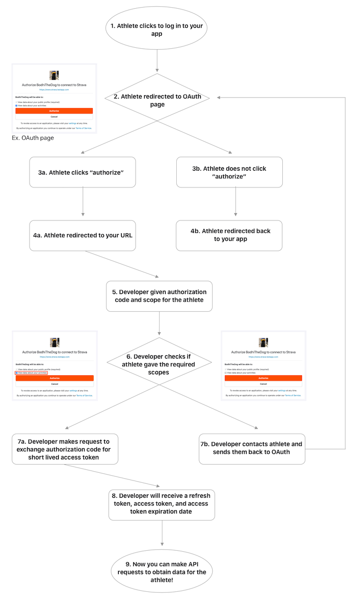
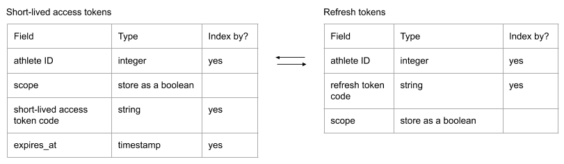

# Objective

Collect Egan activities as uploaded and extract segment efforts to aggregate for results viewer.

# High level flow

User uploads to Strava

Strava invokes webhook API with activity ID

Ack webhook and queues activity+owner ID

App dequeues tuples and fetches activity details

App updates aggregated results and posts to viewer

# Strava API details

## User authentication

https://developers.strava.com/docs/authentication/

activity:read sufficient for public/followers-only

Short-lived and refresh tokens:

## Webhooks

https://developers.strava.com/docs/webhooks/

We're interested in activity updates. When a relevant activity update arrives,
we should store the activity ID and athlete ID and respond with a POST with HTTP
status 200 ASAP. Strava requires that all webhook callbacks ack within 2
seconds.

## API ref

https://developers.strava.com/docs/reference/

## Rate limits

https://developers.strava.com/docs/rate-limits/

The default overall rate limit allows 200 requests every 15 minutes, with up to
2,000 requests per day. The default “non-upload” rate limit allows 100 requests
every 15 minutes, with up to 1,000 requests per day.

An application’s 15-minute limit is reset at natural 15-minute intervals
corresponding to 0, 15, 30 and 45 minutes after the hour. The daily limit resets
at midnight UTC. Requests exceeding the limit will return 429 Too Many Requests
along with a JSON error message. Note that requests violating the short term
limit will still count toward the long term limit.

An application’s limits and usage are reported on the API application settings
page as well as returned with every API request as part of the HTTP Headers:

# Storage

https://developers.cloudflare.com/d1/

## Rides

The app needs access to the ride info. This can be pushed as a static JSON file.

- Week: date (?)
- Route: integer
- Segment IDs: integer, repeated

## User data

For each registered user, the app needs to store:

- Athlete ID: integer, primary key
- Short lived access token: string
- Expires: timestamp
- Refresh token code: string

## Pending activity updates

Stores activities to be process

- Week: date (?)
- Activity ID: integer
- Athlete ID: integer

## Processed activities

Stores processed activity

- Week: date (?)
- Activity ID: integer
- Athlete ID: integer
- Efforts: JSON string of parsed segment efforts

## Results

Stores each week's total results in some form. Should be easy to generate the
JSON format for the viewer, and also easy to update as activities are updated.

## Strava rate limit

Store the time at which we can issue more requests to Strava. If we get a 429
Too Many Requests response from Strava, we can store the time when more requests
can be issued. We can also store the number of requests made within the current
15 minute "slice".

- Expiration time of current slide: date (?)
- Requests remaining in current slice: integer

# Processing model

## Webhook

1. Webhook arrives for activity upload
1. Add activity/athlete ID to pending activity updates table
1. Acknowledge webhook event
1. Trigger pending activities queue update

## Pending activities queue

1. Check if pending activities queue is empty.
1. Check if we have any remaining API requests in this time slice.
1. Pull an activity / athelete pair from the pending table
1. Update the athlete's token if expired
1. Fetch activity details
1. Fetch segment details for activity's week
1. Compute activity results and push to process activities table
1. Trigger results update
